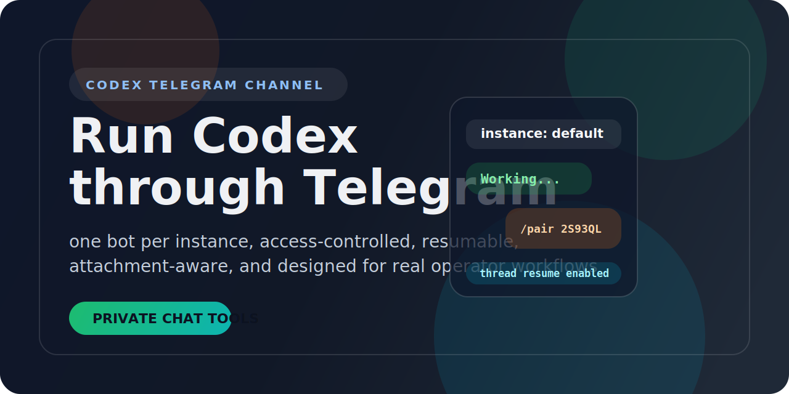

<p align="center">
  <strong>English</strong>&nbsp;&nbsp;|&nbsp;&nbsp;<a href="./README.zh-CN.md"><strong>中文文档</strong></a>
</p>

<p align="center">
  
</p>

<p align="center">
  <a href="https://github.com/cloveric/cc-telegram-bridge/blob/main/LICENSE"></a>
  
  
  
  
  
</p>

<h3 align="center">
  Run a fleet of AI coding agents on Telegram — powered by Codex or Claude Code.<br>
  Each bot gets its own engine, personality, state, and access control.<br>
  <sub>Think <a href="https://github.com/openclaw">OpenClaw</a>, but for Codex and Claude over Telegram.</sub>
</h3>

<p align="center">
  <a href="#-dual-engine">Dual Engine</a>&nbsp;&nbsp;|&nbsp;&nbsp;<a href="#-multi-bot-setup">Multi-Bot</a>&nbsp;&nbsp;|&nbsp;&nbsp;<a href="#-agent-instructions">agent.md</a>&nbsp;&nbsp;|&nbsp;&nbsp;<a href="#-yolo-mode">YOLO</a>&nbsp;&nbsp;|&nbsp;&nbsp;<a href="#-usage-tracking">Usage</a>&nbsp;&nbsp;|&nbsp;&nbsp;<a href="#-quick-start">Quick Start</a>&nbsp;&nbsp;|&nbsp;&nbsp;<a href="#-docker">Docker</a>&nbsp;&nbsp;|&nbsp;&nbsp;<a href="#-service-operations">Ops</a>
</p>

> **RULE 1:** Let your Claude Code or Codex CLI set this up for you. Clone the repo, open it in your terminal, and tell your AI agent: *"read the README and configure a Telegram bot for me"*. It will handle the rest.

---

## Dual Engine: Codex + Claude Code

Each bot instance can run either **OpenAI Codex** or **Claude Code** as its backend. Switch engines per-instance with one command:

```powershell
# Set an instance to use Claude Code
npm run dev -- telegram engine claude --instance review-bot

# Set another to use Codex
npm run dev -- telegram engine codex --instance helper-bot

# Check current engine
npm run dev -- telegram engine --instance review-bot
```

| Feature | Codex Engine | Claude Engine |
|---|---|---|
| CLI command | `codex exec --json` | `claude -p --output-format json` |
| Session resume | `codex exec resume --json <id>` | `claude -p -r <session-id>` |
| Project instructions | `agent.md` (prepended to prompt) | `agent.md` (via `--system-prompt`) + `CLAUDE.md` (auto-loaded from workspace) |
| YOLO mode | `--full-auto` / `--dangerously-bypass-approvals-and-sandbox` | `--permission-mode bypassPermissions` / `--dangerously-skip-permissions` |
| Working directory | N/A | `workspace/` under instance dir (with `CLAUDE.md`) |

### Claude Engine: CLAUDE.md Support

When using the Claude engine, each instance gets a `workspace/` directory. Drop a `CLAUDE.md` in there for project-level instructions that Claude Code reads natively:

```
~/.codex/channels/telegram/review-bot/
├── agent.md              ← "You are a strict code reviewer"
├── workspace/
│   └── CLAUDE.md         ← "TypeScript project. Use ESLint. Never modify tests."
├── config.json           ← { "engine": "claude", "approvalMode": "full-auto" }
└── .env
```

Two layers of instructions, no conflict:
- **agent.md** → Your bot personality (injected via `--system-prompt`)
- **CLAUDE.md** → Project rules (Claude auto-discovers from working directory)

---

## Multi-Bot Setup

Run as many bots as you need. Each instance is fully isolated — its own engine, token, personality, threads, access rules, inbox, and audit trail.

```
          ┌─────────────────────────────────────────────┐
          │          cc-telegram-bridge              │
          └────────────┬──────────────┬─────────────────┘
                       │              │
        ┌──────────────┼──────────────┼──────────────┐
        ▼              ▼              ▼              ▼
 ┌────────────┐ ┌────────────┐ ┌────────────┐ ┌────────────┐
 │  "default" │ │   "work"   │ │ "reviewer" │ │ "research" │
 │  engine:   │ │  engine:   │ │  engine:   │ │  engine:   │
 │   codex    │ │   codex    │ │   claude   │ │   claude   │
 │            │ │            │ │            │ │            │
 │ agent.md:  │ │ agent.md:  │ │ agent.md:  │ │ agent.md:  │
 │ "General   │ │ "Reply in  │ │ "Strict    │ │ "Deep      │
 │  helper"   │ │  Chinese"  │ │  reviewer" │ │  research" │
 └────────────┘ └────────────┘ └────────────┘ └────────────┘
   PID 4821       PID 5102       PID 5340       PID 5520
```

### Deploy in 30 Seconds

```bash
# Configure each instance
npm run dev -- telegram configure <token-A>
npm run dev -- telegram configure --instance work <token-B>
npm run dev -- telegram configure --instance reviewer <token-C>

# Set engines
npm run dev -- telegram engine claude --instance reviewer

# Set personalities
npm run dev -- telegram instructions set --instance reviewer ./reviewer-instructions.md

# Enable YOLO for mobile use
npm run dev -- telegram yolo on --instance work

# Start them all
npm run dev -- telegram service start
npm run dev -- telegram service start --instance work
npm run dev -- telegram service start --instance reviewer
```

---

## Agent Instructions

Each bot has its own `agent.md`. Hot-reloaded on every message — edit anytime, no restart needed.

```powershell
npm run dev -- telegram instructions show --instance work
npm run dev -- telegram instructions set --instance work ./my-instructions.md
npm run dev -- telegram instructions path --instance work
```

Or edit directly:

```powershell
# Windows
notepad %USERPROFILE%\.codex\channels\telegram\work\agent.md

# macOS
open -e ~/.codex/channels/telegram/work/agent.md
```

---

## YOLO Mode

```powershell
npm run dev -- telegram yolo on --instance work      # Safe auto-approve
npm run dev -- telegram yolo unsafe --instance work   # Skip ALL checks
npm run dev -- telegram yolo off --instance work      # Normal flow
npm run dev -- telegram yolo --instance work          # Check status
```

| Mode | Codex | Claude | Use case |
|---|---|---|---|
| `off` | Normal approvals | Normal approvals | Default, safest |
| `on` | `--full-auto` | `--permission-mode bypassPermissions` | Mobile use |
| `unsafe` | `--dangerously-bypass-*` | `--dangerously-skip-permissions` | Trusted env only |

---

## Usage Tracking

Track token consumption and cost per instance:

```bash
npm run dev -- telegram usage                    # Default instance
npm run dev -- telegram usage --instance work    # Named instance
```

Output:
```
Instance: work
Requests: 42
Input tokens: 185,230
Output tokens: 12,450
Cached tokens: 96,000
Estimated cost: $0.3521
Last updated: 2026-04-09T10:00:00Z
```

Claude reports exact USD cost. Codex reports tokens only (cost shows as "unknown").

---

## Verbosity Control

Control how much streaming progress you see:

```bash
npm run dev -- telegram verbosity 0 --instance work   # Quiet — no live updates
npm run dev -- telegram verbosity 1 --instance work   # Normal — update every 2s (default)
npm run dev -- telegram verbosity 2 --instance work   # Detailed — update every 1s
npm run dev -- telegram verbosity --instance work      # Check current level
```

Stored in `config.json`, hot-reloadable.

---

## Quick Start

### Prerequisites

- **Node.js** >= 20
- **OpenAI Codex CLI** and/or **Claude Code CLI** installed and authenticated
- A **Telegram Bot Token** from [@BotFather](https://t.me/BotFather)

### Install

```bash
git clone https://github.com/cloveric/cc-telegram-bridge.git
cd cc-telegram-bridge
npm install
npm run build
```

### Single Bot (Simplest)

```bash
npm run dev -- telegram configure <your-bot-token>
npm run dev -- telegram service start
```

### Claude Bot

```bash
npm run dev -- telegram configure --instance claude-bot <token>
npm run dev -- telegram engine claude --instance claude-bot
npm run dev -- telegram service start --instance claude-bot
```

---

## Architecture

```
┌─────────────────────────────────────────────────────────────────────┐
│                        cc-telegram-bridge                       │
├─────────────┬──────────────┬──────────────────┬─────────────────────┤
│  Telegram   │   Runtime    │     AI Engine    │      State          │
│  Layer      │   Layer      │     Layer        │      Layer          │
├─────────────┼──────────────┼──────────────────┼─────────────────────┤
│ api.ts      │ bridge.ts    │ adapter.ts       │ access-store.ts     │
│ delivery.ts │ chat-queue.ts│ process-adapter  │ session-store.ts    │
│ update-     │ session-     │   .ts (Codex)    │ runtime-state.ts    │
│ normalizer  │ manager.ts   │ claude-adapter   │ instance-lock.ts    │
│   .ts       │              │   .ts (Claude)   │ json-store.ts       │
│ message-    │              │                  │ audit-log.ts        │
│ renderer.ts │              │ agent.md + config│                     │
└─────────────┴──────────────┴──────────────────┴─────────────────────┘
```

**Data flow:**

```
Telegram Update → Normalize → Access Check → Chat Queue (serialized)
    → Load config.json (engine) → Load agent.md → Session Lookup
    → Codex Exec or Claude -p (new or resume)
    → Stream progress to placeholder (every 2s) → Final Render → Deliver → Audit
```

---

## Highlights

<table>
  <tr>
    <td width="50%">
      <h3>Dual Engine</h3>
      <p>Switch between Codex and Claude Code per instance. Mix and match — one bot on Codex, another on Claude, managed from one CLI.</p>
    </td>
    <td width="50%">
      <h3>Per-Bot Personality</h3>
      <p>Each instance loads its own <code>agent.md</code> on every message. Claude instances also get <code>CLAUDE.md</code> project rules.</p>
    </td>
  </tr>
  <tr>
    <td>
      <h3>YOLO Mode</h3>
      <p>One command to auto-approve everything — works with both engines. Per-instance, hot-reloadable.</p>
    </td>
    <td>
      <h3>Full Isolation</h3>
      <p>Every instance: own engine, token, access, sessions, threads, inbox, audit trail, <strong>and engine memory</strong>. One bot's learned context never leaks to another.</p>
    </td>
  </tr>
  <tr>
    <td>
      <h3>Streaming Progress</h3>
      <p>See AI responses as they're generated — the Telegram message updates live every 2 seconds during Codex/Claude execution, instead of waiting for completion.</p>
    </td>
    <td>
      <h3>Production Resilience</h3>
      <p>Long polling (~0ms latency), exponential backoff, 429 auto-retry, 409 conflict auto-shutdown, graceful SIGTERM/SIGINT, fault-tolerant batch processing.</p>
    </td>
  </tr>
  <tr>
    <td>
      <h3>Usage Tracking</h3>
      <p>Per-instance token counts (input/output/cached) and USD cost. <code>telegram usage</code> to check spend anytime.</p>
    </td>
    <td>
      <h3>Verbosity Control</h3>
      <p>Per-instance output level: 0 = quiet, 1 = normal (2s), 2 = detailed (1s). <code>telegram verbosity 2</code> to see more.</p>
    </td>
  </tr>
  <tr>
    <td>
      <h3>Full Audit Trail</h3>
      <p>Every action recorded per-instance in append-only JSONL — filterable by type, chat, and outcome.</p>
    </td>
    <td>
      <h3>Docker Ready</h3>
      <p>Multi-stage Dockerfile included. Build once, deploy anywhere.</p>
    </td>
  </tr>
</table>

---

## Service Operations

| Command | Description |
|---|---|
| `telegram service start` | Acquire lock, load state, begin long-polling |
| `telegram service stop` | Graceful shutdown (SIGTERM/SIGINT) |
| `telegram service status` | Running state, PID, engine, bot identity, audit health |
| `telegram service restart` | Stop + start with clean consumer reset |
| `telegram service logs` | Tail stdout/stderr logs |
| `telegram service doctor` | Health check across all subsystems |
| `telegram engine [codex\|claude]` | Switch AI engine per instance |
| `telegram yolo [on\|off\|unsafe]` | Toggle auto-approval mode |
| `telegram usage` | Show token usage and estimated cost |
| `telegram verbosity [0\|1\|2]` | Set streaming progress level |
| `telegram help` | Show all available commands |

All commands accept `--instance <name>` to target a specific bot.

## Stable Beta Commands

- `telegram service doctor --instance <name>`
- `telegram session list --instance <name>`
- `telegram session inspect --instance <name> <chat-id>`
- `telegram session reset --instance <name> <chat-id>`
- `telegram task list --instance <name>`
- `telegram task inspect --instance <name> <upload-id>`
- `telegram task clear --instance <name> <upload-id>`

Telegram users can also use:

- `/status`
- `/continue`
- `/reset`
- `/help`

For archive summaries, the intended continuation path is to reply to that summary or press its Continue Analysis button; bare `/continue` only resumes the latest waiting archive.

Recovery behavior on unreadable state:

- `telegram service status` and `telegram service doctor` degrade to `unknown (...)` warnings instead of crashing when `session.json` or `file-workflow.json` is unreadable.
- `telegram session inspect` and `telegram task inspect` report unreadable state and stop instead of pretending the record is missing.
- `telegram session reset`, `telegram task clear`, and Telegram `/reset` only self-heal corruption/schema-invalid state. Before writing a default empty file, the unreadable original is quarantined as a backup beside the state file.
- Telegram `/status` shows `unknown (...)` for session/task state when the backing JSON is unreadable.

### Shell Helpers

**Windows (PowerShell):**

```powershell
.\scripts\start-instance.ps1 [-Instance work]
.\scripts\status-instance.ps1 [-Instance work]
.\scripts\stop-instance.ps1 [-Instance work]
```

**macOS / Linux (bash):**

```bash
./scripts/start-instance.sh [work]
./scripts/status-instance.sh [work]
./scripts/stop-instance.sh [work]
```

---

## Access Control

Per-instance, two layers: **pairing** + **allowlist**.

```bash
npm run dev -- telegram access pair <code>
npm run dev -- telegram access policy allowlist
npm run dev -- telegram access allow <chat-id>
npm run dev -- telegram access revoke <chat-id>
npm run dev -- telegram status [--instance work]
```

---

## Audit Trail

Per-instance append-only JSONL log with filterable queries:

```bash
npm run dev -- telegram audit [--instance work]
npm run dev -- telegram audit 50                                    # Last 50 entries
npm run dev -- telegram audit --type update.handle --outcome error  # Filter by type/outcome
npm run dev -- telegram audit --chat 688567588                      # Filter by chat
```

---

## State Layout

```
# Windows: %USERPROFILE%\.codex\channels\telegram\<instance>\
# macOS/Linux: ~/.codex/channels/telegram/<instance>/

<instance>/
├── agent.md                # Bot personality & instructions
├── config.json             # Engine, YOLO mode, verbosity
├── usage.json              # Token usage and cost tracking
├── engine-home/            # Isolated engine config, memory, sessions
│   ├── memory/             # Claude: auto-memory (CLAUDE_CONFIG_DIR)
│   ├── sessions/           # Codex: thread history (CODEX_HOME)
│   └── ...                 # Each bot's engine state is fully isolated
├── workspace/              # Claude working directory (Claude engine only)
│   └── CLAUDE.md           # Claude Code project instructions
├── .env                    # Bot token
├── access.json             # Pairing + allowlist data
├── session.json            # Chat-to-thread bindings
├── runtime-state.json      # Watermarks, offsets
├── instance.lock.json      # Process lock
├── audit.log.jsonl         # Structured audit stream
├── service.stdout.log      # Service stdout
├── service.stderr.log      # Service stderr
└── inbox/                  # Downloaded attachments
```

---

## Development

```bash
npm run dev -- <command>     # Development mode
npm test                     # Run tests
npm run test:watch           # Watch mode
npm run build                # Build for production
npm start                    # Start production build
```

---

## Docker

```bash
# Build
docker build -t cc-telegram-bridge .

# Run (configure first, then start)
docker run -v ~/.codex:/root/.codex cc-telegram-bridge telegram configure <token>
docker run -v ~/.codex:/root/.codex cc-telegram-bridge telegram service start
```

Mount `~/.codex` to persist state across container restarts.

---

## Troubleshooting

<details>
<summary><strong>Bot does not reply</strong></summary>

1. Run `telegram service doctor --instance <name>` to diagnose
2. Check `telegram service logs` for errors
3. Verify the engine is installed: `codex --version` or `claude --version`

</details>

<details>
<summary><strong>Switching to Claude engine</strong></summary>

1. `telegram engine claude --instance <name>`
2. Restart the service: `telegram service restart --instance <name>`
3. Optionally add a `CLAUDE.md` in the workspace directory

</details>

<details>
<summary><strong>Bot sends duplicate replies</strong></summary>

A 409 Conflict means two processes are polling the same bot token. The service auto-detects this and shuts down. Run `telegram service status` to check, then `telegram service stop` and `telegram service start` to clean restart.

</details>

<details>
<summary><strong>agent.md changes not taking effect</strong></summary>

No restart needed — loaded fresh on every message. Verify path with `telegram instructions path --instance <name>`.

</details>

---

## License

[MIT](./LICENSE)

---

<p align="center">
  <sub>Your agents. Your engines. Your rules.</sub>
</p>
